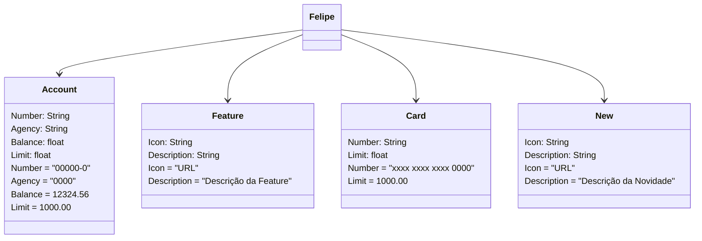

# Santander 2024 Backend com Java
Jaba RESTful API criada para o Boot Camp Santander Backend

## Diagrama de Classes do projeto

```mermaid
classDiagram
    class Felipe {
    }
    class Account {
        Number: String
        Agency: String
        Balance: float
        Limit: float
    }
    class Feature {
        Icon: String
        Description: String
    }
    class Card {
        Number: String
        Limit: float
    }
    class New {
        Icon: String
        Description: String
    }
    
    Felipe --> Account
    Account : Number = "00000-0"
    Account : Agency = "0000"
    Account : Balance = 12324.56
    Account : Limit = 1000.00
    
    Felipe --> Feature
    Feature : Icon = "URL"
    Feature : Description = "Descrição da Feature"
    
    Felipe --> Card
    Card : Number = "xxxx xxxx xxxx 0000"
    Card : Limit = 1000.00
    
    Felipe --> New
    New : Icon = "URL"
    New : Description = "Descrição da Novidade"

```
